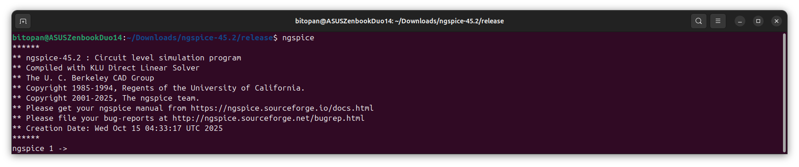

# Day 1: Introduction to SPICE Simulation & MOSFET I–V Characteristics
 
The focus of today is to step into the analog world and explore how MOSFETs truly behave beneath the surface — through the lens of SPICE simulations. We begin by understanding the fundamentals of circuit design and how SPICE serves as the designer’s microscope to visualize transistor behavior. Then, we unravel the physics of the NMOS transistor — its structure, threshold voltage, modes of operation, and current equations. Finally, we perform a hands-on SPICE lab to simulate the NMOS drain current ($I_D$) versus drain-to-source voltage ($V_{DS}$), validating theory with real device characteristics.

---

## 📜 Table of Contents
[1. Introduction to Circuit Design and SPICE Simulation](#1-introduction-to-circuit-design-and-spice-simulation)<br>
[2. MOSFET Fundamentals: The Heart of SPICE Simulations](#2-mosfet-fundamentals-the-heart-of-spice-simulations)<br>
[3. MOSFET Modes of Operation & Current Derivations](#3-mosfet-modes-of-operation--current-derivations)<br>
[4. SPICE Simulation Setup and Model Parameters](#4-spice-simulation-setup-and-model-parameters)<br>
[5. Lab: Introductory SPICE Simulation](#5-labs-introductory-spice-simulations)<br>

---

## 1. Introduction to Circuit Design and SPICE Simulation.

### <ins>1. What is Circuit Design?</ins>
Circuit design is the art and science of combining electronic components — transistors, resistors, capacitors, logic gates — to achieve a specific functional goal.<br>
In digital design, this means creating circuits that implement logic functions like AND, OR, XOR, and beyond.<br>
In analog design, this means crafting circuits that process continuous signals — amplifiers, filters, oscillators, etc.<br>
At the heart of it all lies a single question: *“How do I connect devices to make electrons behave the way I want?”*<br><br>
So when we design a cell (say, an inverter, NAND, or flip-flop), we decide:
- Which components (MOSFETs, resistors, etc.) we’ll use
- How they’re connected (topology)
- What transistor sizes (W/L ratios) to choose — because size controls strength, delay, and power

A good designer doesn’t just make a circuit work — they make it work efficiently.

### <ins>2. SPICE Simulation — The Designer’s Microscope</ins>
Once a circuit is designed, we need to validate its behavior before committing it to silicon. That’s where SPICE (Simulation Program with Integrated Circuit Emphasis) comes in.<br>
SPICE simulates how your circuit behaves by solving the underlying nonlinear differential equations for voltages and currents across all devices.<br><br>
Why we use SPICE:
- To visualize voltage transfer characteristics (like Vin–Vout curves for logic gates)
- To measure propagation delays and rise/fall times
- To explore power consumption, noise margins, and transistor behavior under varying loads

*Example:*<br>
When you simulate a CMOS inverter in SPICE, you’ll obtain its Vin–Vout transfer curve, which shows how the output responds as the input voltage sweeps from 0 V to VDD.<br>
From this, you can measure:
- **Switching threshold (Vm)** — where Vin = Vout
- **Rise/fall delays** — how long it takes the output to change
- **Drive strength** — how fast the cell can charge/discharge a given load

By adjusting the W/L ratios of the PMOS and NMOS transistors, you can fine-tune the inverter’s delay and switching behavior — balancing speed and power.

---

## 2. MOSFET Fundamentals: The Heart of SPICE Simulations.
Modern IC design, whether analog or digital, revolves around a single workhorse: the MOSFET (Metal–Oxide–Semiconductor Field-Effect Transistor).<br>
It’s the fundamental building block for CMOS logic, amplifiers, memory, and almost every integrated system you can imagine.<br>
Let’s break down its structure, working, and how its physical behavior connects directly to what SPICE simulates.

### <ins>1. NMOS Transistor — Structure & Terminals</ins>
An NMOS transistor is a four-terminal device, consisting of:
- G — Gate
- S — Source
- D — Drain
- B — Body (or Bulk)

<ins>*Physical Structure*</ins>
The NMOS is built on a p-type substrate. Into this substrate, two n+ diffusion regions are created — these form the source and drain.<br>
A thin layer of silicon dioxide (SiO₂) acts as the gate oxide, separating the substrate from the gate electrode, which is made of polysilicon or metal.<br>
Below is the conceptual structure:<br>
<div align="center">
  
</div>

### <ins>2. PMOS Transistor — Structure & Terminals</ins>
A PMOS transistor is the complementary twin of NMOS.<br>
It has the same four terminals — Gate, Source, Drain, Body — but is built in an n-type substrate (or an n-well). The source and drain are p+ diffusion regions.<br>
Its behavior is essentially inverted:
- It conducts when VGS < Vth (since its Vth is negative).
- The majority carriers are holes, not electrons.

So while NMOS turns on when the gate is high, PMOS turns on when the gate is low.<br>
This opposite behavior is what makes CMOS (Complementary MOS) logic possible — one transistor pulls up, the other pulls down, ensuring low static power and sharp transitions.

### <ins>3. Threshold Voltage (Vth) — The Gatekeeper</ins>
The threshold voltage is the magic point where a MOSFET begins to conduct.<br>
Let’s understand how it emerges, step by step, for a NMOS (the same logic applies inversely for PMOS):
1. At VGS = 0
   * Source, drain, and bulk (body) are at ground.
   * The substrate–source and substrate–drain junctions act like reverse-biased PN diodes, so no current flows.
   * The path between source and drain is high resistance.
2. Apply a positive VGS
   * The gate behaves like a capacitor with the oxide as the dielectric.
   * The positive gate voltage repels holes (majority carriers in the p-substrate) away from the surface.
   * A depletion region begins to form beneath the gate as fixed negative acceptor ions are exposed.
3. Increase VGS further → Strong Inversion
   * At a critical voltage (the threshold voltage, Vth), electrons start to accumulate at the surface, effectively inverting that small region from p-type to n-type.
   * This creates a conductive channel between source and drain.
4. Apply a drain voltage
   * Electrons now flow from the source to the drain through this channel, controlled by VGS.
   * The transistor has officially turned on.

*In short: Threshold voltage is the minimum gate voltage required to form a continuous conducting channel between source and drain.*

### <ins>4. The Role of the Body Terminal — The Quiet Influencer</ins>
Though often tied to a fixed potential (usually ground for NMOS, VDD for PMOS), the body terminal has a subtle but crucial influence on transistor behavior.

- Body Bias and Depletion Region<br>
  If we apply a negative body-to-source voltage (VSB) in an NMOS:
  * The depletion region widens between the source and the body.
  * This means the channel formation requires more gate voltage — effectively increasing the threshold voltage (Vth).

    <div align="center">
      
    </div>

- The Body Effect Equation<br>
  The relationship between Vth and VSB is given by:

$$
V_{th} = V_{t0} + \gamma \left( \sqrt{\left| -2\phi_F + V_{SB} \right|} - \sqrt{\left| -2\phi_F \right|} \right)
$$

where:

- $$\( V_{th} \)$$ — Threshold voltage with body bias 
- $$\( V_{t0} \)$$ — Zero-bias threshold voltage (when $$\( V_{SB} = 0 \)$$)  
- $$\( \gamma \)$$ — Body effect coefficient (in $$\( V^{0.5} \)$$)  
- $$\( \phi_F \)$$ — Fermi potential  
- $$\( V_{SB} \)$$ — Source-to-body voltage  

> When $$\( V_{SB} \)$$ increases (i.e., body becomes more negatively biased for NMOS),  
> the threshold voltage $$\( V_{th} \)$$ **increases**, delaying the onset of inversion.

### <ins>5. How SPICE Models This</ins>
In SPICE simulations, all these physical phenomena — oxide thickness, doping concentration, threshold variation, and body bias — are abstracted into model parameters supplied by the foundry.<br>
So when you run a SPICE simulation, you’re not hand-writing these physics equations — you’re referencing a .model file that contains these constants.<br><br>
<ins>*For example:*</ins>
```
.model NMOS NMOS (VTO=0.7 GAMMA=0.4 PHI=0.7)
```
This line tells SPICE:
- The transistor’s threshold voltage is 0.7 V
- The body effect coefficient (γ) is 0.4 V⁰·⁵
- The Fermi potential (ϕF) is 0.7 V

SPICE then uses these to compute the current–voltage characteristics under various biases.

---

## 3. MOSFET Modes of Operation & Current Derivations.
Once a channel is formed (when $$V_{GS} > V_{th}$$), the MOSFET behaves like a voltage-controlled current source.<br>
Depending on the applied voltages $$V_{GS}$$ and $$V_{th}$$, it operates in one of three regions:
- Cutoff Region
- Linear (Resistive) Region
- Saturation Region

### <ins>1. Modes of Operation</ins>
| Region | Condition | Description |
|----------|----------|----------|
| Cutoff | $$V_{GS} < V_{th}$$ | No inversion channel formed. The transistor is OFF. Only leakage current flows. |
| Linear / Resistive | $$0 < V_{DS} < (V_{GS} - V_{th})$$ | A conductive channel exists; current increases linearly with $$V_{GS}$$. Acts like a voltage-controlled resistor. |
| Saturation | $$V_{DS} > (V_{GS} - V_{th})$$ | Channel is pinched off near the drain; current becomes almost constant. |

### <ins>2. Channel Charge Dependence on $$(V_{GS} - V_{th})$$</ins>
When $$(V_{GS} = V_{th})$$, strong inversion begins — a conductive n-channel forms (for NMOS). For any voltage beyond this threshold, the number of mobile charge carriers (and thus the effective channel width) depends directly on the overdrive voltage, $$(V_{GS} - V_{th})$$.<br>
This is under the condition that $$V_{DS}$$=0, i.e., no drain bias applied yet.

### <ins>3. Voltage Gradient Along the Channel</ins>
When a drain-to-source voltage ($$V_{DS}$$) is applied, a potential gradient develops along the channel:
- Near the source, the local channel potential is 0 V.
- Near the drain, it rises to $$V_{DS}$$.

Thus, the effective gate-to-channel voltage varies along the length of the channel:

$$
V_{GC}(x) = V_{GS} - V(x)
$$

As a result, the local channel charge density at position $$x$$ is:

$$
Q_i(x) = -C_{ox} \left[ (V_{GS} - V(x)) - V_{th} \right]
$$

where:
- $$C_{ox}$$ = gate oxide capacitance per unit area
- $$V(x)$$ = local potential at position $$x$$ along the channel

The oxide capacitance is defined as:

$$
C_{ox} = \frac{\varepsilon_{ox}}{t_{ox}}
$$

and the oxide permittivity:

$$
\varepsilon_{ox} = 3.97 \times \varepsilon_0 \approx 3.5 \times 10^{-11} \ \text{F/m}
$$

### <ins>4. Current Components in a MOSFET</ins>
From the viewpoint of semiconductor physics, two mechanisms govern current flow:
- **Drift current** — due to the potential difference along the channel.
- **Diffusion current** — due to carrier concentration gradients.

In strong inversion (normal MOS operation), drift current dominates.
The instantaneous drain current is given by:

$$
I_D = -v_n(x) \cdot Q_i(x) \cdot W
$$

where:
- $$v_n(x) \text{ = velocity of charge carriers at position } x$$
- $$Q_i(x) \text{ = inversion charge density}$$
- $$W \text{ = width of the transistor channel}$$

The drift velocity is related to the electric field by:

$$
v_n(x) = \mu_n \cdot E(x)
$$

and since $$E(x) = -\frac{dV(x)}{dx}$$:

$$
I_D = \mu_n \cdot W \cdot C_{ox} \left[ (V_{GS} - V_{th}) - V(x) \right] \left( \frac{dV(x)}{dx} \right)
$$

To find the total drain current, this expression is integrated across the channel length.

### <ins>5. Process Transconductance Parameter ($$k_n'$$)</ins>
The process transconductance parameter, $$k_n'$$ combines physical constants that determine how strongly the MOSFET can drive current:

$$
k_n' = \mu_n \cdot C_{ox}
$$

where:
- $$\mu_n \text{ = electron mobility}$$
- $$C_{ox} \text{ = gate oxide capacitance per unit area}$$

It expresses the current-driving capability per unit transistor geometry.

### <ins>6. Gain Factor (kn) ($$k_n$$)</ins>
The gain factor ($$k_n$$)(sometimes called the device transconductance parameter) includes transistor geometry (width and length):

$$
k_n = k_n' \cdot \frac{W}{L} = \mu_n C_{ox} \frac{W}{L}
$$

This factor is what determines how strongly a particular MOSFET (of given size) responds to gate voltage changes.

### <ins>7. Linear (Resistive) Region</ins>
For all $$V_{DS} \leq (V_{GS} - V_{th})$$, the MOSFET operates in the linear region.<br>
Here, the channel is continuous from source to drain, and the current increases almost linearly with $$V_{DS}$$.<br>
After integrating the drift current equation over the channel length L:

$$
I_D = k_n \left[ (V_{GS} - V_{th}) V_{DS} - \frac{V_{DS}^2}{2} \right]
$$

This shows that at small $$V_{DS}$$, the MOSFET behaves like a voltage-controlled resistor.

### <ins>8. Saturation Region & Pinch-Off Phenomenon</ins>
As $$V_{DS}$$ increases further, a critical point occurs when:

$$
V_{DS} = V_{GS} - V_{th}
$$

At this point, the inversion layer disappears near the drain — this is the Pinch-Off Phenomenon.<br>
The channel no longer extends fully from source to drain, but a small region near the drain becomes depleted.<br>
Even though the physical channel shortens, electrons continue to drift from the channel to the drain due to the strong electric field at the pinch-off point.<br>
Hence, beyond this point, the drain current becomes almost independent of $$V_{DS}$$, and the MOSFET enters saturation.<br>
The current in this region is given by:

$$
I_D = \frac{k_n}{2} (V_{GS} - V_{th})^2
$$

### <ins>9. Channel Length Modulation (λ Effect)</ins>
In practice, $$I_D$$ is not perfectly constant in saturation.<br>
As $$V_{DS}$$ increases, the depletion region at the drain widens, effectively reducing the channel length, which slightly increases $$I_D$$.<br>
To account for this, the equation is modified as:

$$
I_D = \frac{k_n}{2} (V_{GS} - V_{th})^2 \left( 1 + \lambda V_{DS} \right)
$$

where:
- λ = channel length modulation factor, typically a small positive constant (≈ 0.01 – 0.05 V⁻¹)

*This effect is similar to the Early effect in BJTs — it introduces a small output conductance in the supposedly “constant current” region.*

### <ins>10. Why Use SPICE Simulations?</ins>
While these equations provide deep physical insight, manually computing $$I_D$$ for every $(V_{GS}, V_{DS})$ combination is tedious and error-prone. This is where SPICE simulations shine — they numerically evaluate these equations (and more complex effects) using accurate foundry-provided models.<br>
In SPICE, you can sweep $$\( V_{GS} \)$$ and $$\( V_{DS} \)$$ to obtain:

- $$\( I_D - V_{DS} \)$$ output characteristics,  
- $$\( I_D - V_{GS} \)$$ transfer characteristics,
- Extraction of parameters like $$V_{th},  k_n,  \lambda$$, and more.

---

## 4. SPICE Simulation Setup and Model Parameters.

### <ins>1. Understanding SPICE Model Parameters</ins>
During a SPICE simulation, the equations that define transistor behavior contain constants that depend on the process technology used by the semiconductor foundry. Each technology node (e.g., 180 nm, 130 nm, 65 nm, etc.) has its own set of parameters — these are known as SPICE model parameters.<br>
These parameters capture physical effects like:
- Oxide thickness
- Threshold voltage
- Mobility of carriers
- Body effect constants
- Channel length modulation

They are provided by the foundry in a model file, which SPICE reads to accurately simulate the transistor behavior.

>[!CAUTION]
>Before running a SPICE simulation, always ensure that:
>- The SPICE model file corresponds to the correct technology node, and
>- The SPICE netlist (circuit description) properly references the model.

Once both are set up, running the simulation yields the I<sub>DS</sub> vs V<sub>DS</sub> characteristic curves.

### <ins>2. SPICE Netlist Basics</ins>
SPICE uses a netlist — a text-based description of an electrical circuit — to define components, nodes, and their interconnections.<br>
A typical SPICE netlist includes:
1. Component definitions (MOSFETs, resistors, voltage sources, etc.)
2. Node connections (naming each connection point)
3. References to the model file
4. Simulation commands

Below is a simple example of a MOSFET-based SPICE netlist:
```
* Example NMOS Test Circuit
M1 vdd n1 0 0 nmos W=1.8u L=1.2u
R1 in n1 55
Vdd vdd 0 2.5
Vin in 0 2.5
```

<div align="center">
  
</div>
   
*Breakdown:*
- M1 → MOSFET instance (devices starting with `M` are MOSFETs)
  * `vdd n1 0 0` are node names corresponding to Drain, Gate, Source, and Body respectively
  * `nmos` refers to the model name from the technology file
  * `W` and `L` define the width and length of the MOSFET
- R1 → Resistor (`R` prefix), connected between nodes `in` and `n1` with a resistance of 55 Ω
- Vdd, Vin → Voltage sources (`V` prefix), defining supply and input voltages

### <ins>3. The Technology File (Model File)</ins>
The technology file — often ending in `.mod` or `.model` — provides SPICE with the physical and electrical characteristics of the devices.<br>
Each transistor type (NMOS or PMOS) is defined under a `.MODEL` directive, specifying parameters like threshold voltage, mobility, oxide thickness, and body-effect constants.<br>
Here’s a simplified example of a model file:
```
.lib cmos_models
.MODEL nmos NMOS (TOX=4e-9 VTH0=0.7 U0=450 GAMMA1=0.6)
.MODEL pmos PMOS (TOX=4e-9 VTH0=-0.9 U0=200 GAMMA1=0.5)
.endl
```

You can package this as a `.mod` file, for example:
```
xxxx_025um_model.mod
```

Then, include it in your SPICE netlist as follows:
```
.LIB "xxxx_025um_model.mod" CMOS_MODELS
```

Here, `CMOS_MODELS` refers to the section name inside the `.mod` file (`.lib cmos_models` ... `.endl`).

---

## 5. Labs: Introductory SPICE Simulations.

### <ins>1. Installing Ngspice on Ubuntu</ins>
Before running SPICE simulations, we first need to install Ngspice, an open-source SPICE simulator widely used for circuit analysis and device characterization.<br>
<ins>*Step-by-Step Installation Guide*</ins>
1. Download the Ngspice Tarball<br>
   Visit the following page and download the latest release of Ngspice: [https://sourceforge.net/projects/ngspice/files/](https://sourceforge.net/projects/ngspice/files/)
2. Extract the Tarball<br>
   Open a terminal in the directory where the file was downloaded and run:
   ```
   tar -zxvf ngspice-45.2.tar.gz
   cd ngspice-45.2
   ```
3. Create a Release Directory and Configure<br>
   ```
   mkdir release
   cd release
   ../configure --with-x --with-readline=yes --disable-debug   
   ```
4. Build Ngspice<br>
   ```
   make  
   ```
5. Install Ngspice System-Wide<br>
   ```
   sudo make install 
   ```
6. Verify Installation<br>
   Once installation is complete, run the following command to confirm:
   ```
   ngspice
   ```

   If the installation was successful, you’ll see a message similar to:
   <div align="center">
     
   </div>

### <ins>2. Setting Up the SPICE Simulation Environment</ins>
Now that Ngspice is successfully installed, the next step is to set up our SPICE simulation environment by cloning a repository that contains all the required netlists, model files, and example circuits.

1. **Cloning the Repository**<br>
   Start by cloning the official Sky130 Circuit Design Workshop repository by Kunal Ghosh. This repo contains pre-written SPICE files and model libraries based on the SkyWater 130nm technology.
   ```
   git clone https://github.com/kunalg123/sky130CircuitDesignWorkshop.git
   cd sky130CircuitDesignWorkshop
   ```

2. **Repository Structure Overview**<br>
   Here’s what the folder hierarchy looks like once the repository is cloned:
   ```
   sky130CircuitDesignWorkshop/
   │
   ├── design/
   │   ├── sky130_fd_pr/
   │   │   ├── cells/
   │   │   │   ├── nfet_01v8/
   │   │   │   │   └── <various .spice files>
   │   │   │   └── pfet_01v8/
   │   │   │       └── <various .spice files>
   │   │   ├── models/
   │   │   │   ├── parameters/
   │   │   │   │   └── <various .spice files>
   │   │   │   ├── sky130.lib.spice
   │   │   │   └── all.spice
   │   │   └── ...
   │   └── <various SPICE netlists>
   │
   └── README.md
   ```

### <ins>3. Lab 1 - NMOS I<sub>D</sub>–V<sub>GS</sub> SPICE Simulation</ins>
In this first lab, we’ll perform a DC simulation of an NMOS transistor to observe the Drain Current (I<sub>D</sub>) vs Gate Voltage (V<sub>GS</sub>) characteristics using Ngspice.<br>
This simulation helps visualize how the transistor transitions through different regions of operation — cutoff, linear, and saturation — as V<sub>GS</sub> increases.

1. **Step 1: Navigating to the Design Folder**<br>
   Open a terminal and move into the cloned repository’s `design` directory:
   ```
   cd sky130CircuitDesignWorkshop/design
   ```

2. **Step 2: Running the SPICE Netlist**<br>
   ```
   ngspice day1_nfet_idvds_L2_W5.spice
   ```

   This command launches Ngspice, which loads the `.spice` netlist file describing the NMOS test circuit.

3. **Step 3: Plotting the Drain Current**<br>
   Once inside the Ngspice interactive shell, plot the drain current using:
   ```
   plot -vdd#branch
   ```

   <ins>*Explanation:*</ins><br>
   The command plot `-vdd#branch` tells Ngspice to plot the negative current through the voltage source Vdd — effectively giving the drain current (I<sub>D</sub>) as the circuit’s output current. The negative sign is used because SPICE measures current entering the positive terminal of the voltage source, while we are interested in current flowing out of the drain.

4. **Step 4: Viewing the Output**<br>
   The output is the I<sub>D</sub> vs V<sub>GS</sub> curve, which demonstrates how the NMOS device behaves as the gate voltage increases.
   <div align="center">
     
   </div>

5. **Step 5: Graph Observation**<br>
   The plot shows I<sub>D</sub> (µA) on the Y-axis and V<sub>DS</sub> (V) on the X-axis, for various V<sub>GS</sub> levels (0 V → 1.8 V, step 0.2 V).
   - The threshold voltage (V<sub>TH</sub>) of the NMOS transistor is approximately 0.55 V.
   - For V<sub>GS</sub> < 0.55 V, the transistor remains off (cutoff region), and I<sub>D</sub> ≈ 0 A — hence no visible curve.
   - At V<sub>GS</sub> = 0.6 V, a very small drain current appears, indicating that the transistor has just entered weak inversion / near-cutoff.
   - For V<sub>GS</sub> > 0.6 V, the transistor starts conducting significantly — the curves rise quickly with increasing V<sub>DS</sub>, first showing linear (ohmic) behavior and then flattening into saturation as V<sub>DS</sub> ≈ V<sub>GS</sub> – V<sub>TH</sub>.
   - Increasing V<sub>GS</sub> shifts the curve upward, showing higher channel conductance and stronger drive capability.
  
     *This plot confirms that the transistor model and biasing setup in Ngspice are functioning correctly. The smooth transition from linear to saturation regions validates the SPICE NMOS model behavior.*

6. **Step 6: Netlist Reference**<br>
   For reference, the SPICE netlist file used for this simulation can be found in your cloned repository at:
   ```
   sky130CircuitDesignWorkshop/design/day1_nfet_idvds_L2_W5.spice
   ```


   
