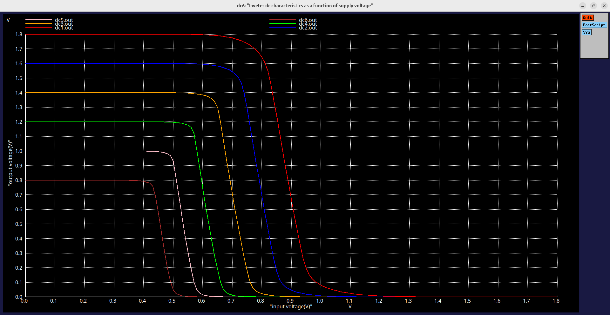
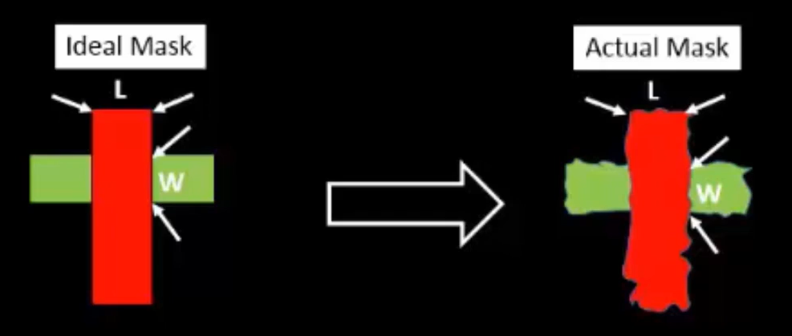
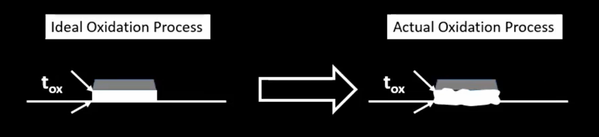
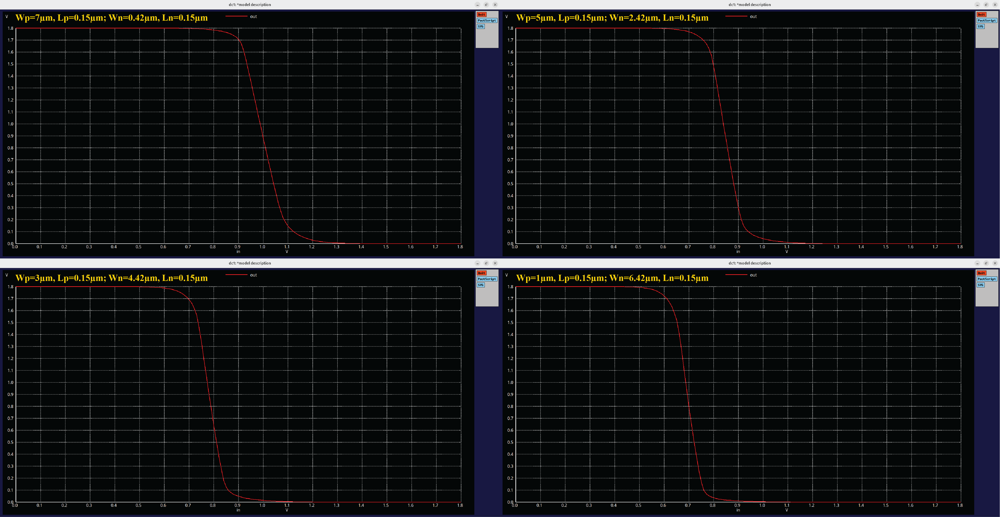

# Day 5: CMOS Power Supply and Device Variation Robustness Evaluation

Today we explore how CMOS circuits respond to power supply scaling and device-level variations — two forces that shape every chip’s behavior. As VDD lowers, power and energy shrink, but performance and noise margins begin to fade. And beyond voltage lies the subtler challenge of fabrication variations — where no two transistors are truly alike. Through today’s simulations, we’ll see how CMOS gracefully balances efficiency, speed, and robustness, even in the face of imperfection.

---

## 📜 Table of Contents
[1. The Concept of Power Supply Scaling](#1-the-concept-of-power-supply-scaling) 
[2. Lab: Power Supply Scaling](#2-lab-power-supply-scaling) 
[3. Gain and Amplification Behavior](#3-gain-and-amplification-behavior) 
[4. Energy Consumption](#4-energy-consumption) 
[5. Performance Degradation](#5-performance-degradation) 
[6. The Fundamental Trade-off](#6-the-fundamental-trade-off) 
[7. Device Variations and CMOS Robustness](#7-device-variations-and-cmos-robustness) 
[8. Lab: Impact of Device Parameter Variations on CMOS VTC](#8-lab-impact-of-device-parameter-variations-on-cmos-vtc)

---

## 1. The Concept of Power Supply Scaling
As CMOS technologies evolve toward smaller technology nodes, every physical parameter — transistor length, width, oxide thickness, etc. — must be scaled down to achieve higher density and speed. However, to maintain similar electrical behavior and prevent breakdown due to high electric fields, the supply voltage $$(V_{DD})$$ must also be proportionally scaled. 
Mathematically, for ideal scaling,

$$
V_{DD,new} = \frac{V_{DD,old}}{S}
$$

where $$(S > 1)$$ is the scaling factor. 
This process ensures:
- Constant electric field within the MOSFET channel
- Similar current–voltage relationships
- Controlled power dissipation

---

## 2. Lab: Power Supply Scaling
### <ins>1. Objective</ins>
To understand how scaling the power supply voltage (VDD) affects the performance characteristics of a CMOS inverter — including gain, switching threshold, energy, and delay behavior.

### <ins>2. Experimental Setup</ins>
| Parameter                    | Description      | Value                          |
| :--------------------------: | :--------------: | :----------------------------: |
| Wp                | Width of PMOS    | 1 µm                           |
| Wn                | Width of NMOS    | 0.36 µm                        |
| Lp, Ln | Channel Lengths  | 0.15 µm                        |
| Cload             | Load Capacitance | 50 fF                          |
| VDD sweep         | Supply Voltage   | 1.8 V → 0.8 V (steps of 0.2 V) |

A single SPICE deck was used to automatically sweep the power supply voltage and generate all the inverter transfer characteristics in one plot. The `.spice` file (SPICE Netlist) is named `day5_inv_supplyvariation_Wp1_Wn036.spice` and can be found in the `design` directory.

### <ins>3. Result: Inverter VTC for Different VDD</ins>

 
 
<em>Each curve corresponds to a different supply voltage, decreasing from 1.8 V (rightmost curve) to 0.8 V (leftmost curve), in steps of 0.2 V</em>

### <ins>4. Observations and Analysis</ins>
| VDD (V) | VOH (V) | VOL (V) | VIL (V) | VIH (V) | VM (V) | Gain (approx) | Comments                          |
| :----------------: | :----------------: | :----------------: | :----------------: | :----------------: | :---------------: | :-----------: | :-------------------------------- |
|         1.8        |        ~1.8        |         ~0         |        ~0.75       |        ~1.0        |       ~0.88       |      High     | Sharp transition, ideal switching |
|         1.6        |        ~1.6        |         ~0         |        ~0.68       |        ~0.92       |       ~0.80       |     Higher    | Steeper VTC, increased gain       |
|         1.4        |        ~1.4        |         ~0         |        ~0.61       |        ~0.83       |       ~0.72       |   Very High   | Peak amplification region         |
|         1.2        |        ~1.2        |         ~0         |        ~0.54       |        ~0.75       |       ~0.65       |    Moderate   | Transition slightly smoother      |
|         1.0        |        ~1.0        |         ~0         |        ~0.46       |        ~0.65       |       ~0.56       |      Low      | Reduced switching speed           |
|         0.8        |        ~0.8        |         ~0         |        ~0.38       |        ~0.54       |       ~0.46       |    Very Low   | Inverter becomes sluggish         |

---

## 3. Gain and Amplification Behavior
Gain of the inverter is given by the slope in the transition region:

$$
A_v = \frac{\Delta V_{out}}{\Delta V_{in}} = -\frac{g_m}{g_{ds}}
$$

- At high VDD, both NMOS and PMOS transistors have large overdrive voltages (VGS − Vth), giving strong transconductance (gm) and steep switching.
- As VDD decreases, gm decreases, and the transition region flattens — reducing the magnitude of gain.

Yet, interestingly, in the mid-range supply voltages (1.2–1.4 V), the inverter exhibits a high normalized gain relative to its supply — because both transistors enter saturation around the same time, providing strong voltage transfer efficiency. 
You can literally see this in your curves — between 1.2 V and 1.4 V, the VTC is the steepest. That’s the sweet spot of amplification

---

## 4. Energy Consumption
Every time the inverter output toggles, it charges and discharges the load capacitance (CL) through the supply. 
The energy drawn from the supply per transition is:

$$
E = \frac{1}{2} C_L V_{DD}^2 
$$

This quadratic dependence means:
- Reducing VDD from 1.8 V to 0.8 V reduces dynamic energy consumption by almost 80 %.
- That’s a massive win for low-power design, especially in battery-operated or IoT devices.

In our setup, 
CL = 50 fF ⇒
| VDD | Energy (aJ) |
| :------------: | :---------: |
|       1.8      |    81 aJ    |
|       1.4      |    49 aJ    |
|       1.0      |    25 aJ    |
|       0.8      |    16 aJ    |

Thus, power scales beautifully — but mind it, it’s not a free lunch.

---

## 5. Performance Degradation
Lowering VDD also lowers the drain current (IDS) because the overdrive voltage decreases:

$$
I_{DS} \propto (V_{DD} - V_{th})^2
$$

Consequently, the RC delay of charging/discharging the output node increases:

$$
\tau = R_{on} C_L \propto \left(\frac{1}{I_{DS}}\right) C_L
$$

So while energy consumption shrinks, switching speed suffers — transitions become slower, edges blur, and timing margins tighten. 
This trade-off is beautifully visible in our curves:
- At high VDD, the transition is razor-sharp — instantaneous.
- At low VDD, the output drags behind the input, hinting at longer delays.

---

## 6. The Fundamental Trade-off
This is the heart of the experiment — the eternal VLSI design trade-off:
| Parameter      | High VDD | Low VDD |
| :------------: | :-----------------: | :----------------: |
| Power / Energy | 🔺 High             | 🔻 Low             |
| Gain           | 🔺 Strong           | 🔻 Weak            |
| Delay          | 🔻 Fast             | 🔺 Slow            |
| Noise Margins  | 🔺 Large            | 🔻 Small           |
| Reliability    | 🔺 Stable           | ⚠️ Sensitive       |

Lowering supply voltage saves power, but slows the circuit and reduces noise margins — an unavoidable tug-of-war between efficiency and speed. 
The art of modern CMOS design lies in choosing the right balance — enough voltage to sustain performance, but not a drop more than necessary.

---

## 7. Device Variations and CMOS Robustness
### <ins>1. Introduction</ins>
Even after mastering power scaling and transient behavior, one truth remains — *no two transistors on a chip are ever truly identical*. 
Manufacturing is a dance of atomic precision, yet even nanometers of deviation can echo through a circuit’s performance. This is where the study of Device Variations begins — understanding how physical imperfections ripple into electrical behavior.

### <ins>2. Sources of Variations</ins>
1. Etching Process Variation: 
   During fabrication, etching defines the transistor’s physical geometry — its Width (W) and Length (L). But etching is a complex interplay of plasma, temperature, and time. Microscopic deviations occur, and as a result, the actual W/L ratio of each device may differ slightly from its intended value.
   

    
    
<em>Device Variation due to Etching</em>

   

   Since the drain current (ID) depends directly on this ratio:

$$
I_D = \mu C_{ox} \frac{W}{L} \left[ (V_{GS} - V_T) V_{DS} - \frac{V_{DS}^2}{2} \right]
$$

   &emsp;&emsp;Any fluctuation in W or L introduces changes in the transistor’s current-driving capability.

2. Oxide Thickness Variation: 
The second major culprit lies in oxide growth. 
   

    
    
<em>Device Variation due to Oxide Thickness Variation</em>

   

   
   &emsp;The thin oxide layer that separates gate and channel determines the gate capacitance:

$$
C_{ox} = \frac{\varepsilon_{ox}}{t_{ox}}
$$

   &emsp;&emsp;and so drain current (ID) can be written as:

$$
I_D = \mu (\frac{\varepsilon_{ox}}{t_{ox}}) \frac{W}{L} \left[ (V_{GS} - V_T) V_{DS} - \frac{V_{DS}^2}{2} \right]
$$

   &emsp;&emsp;A thicker oxide means smaller Cox → weaker gate control → smaller current. 
   &emsp;&emsp;A thinner oxide means stronger gate control → larger current. 
   &emsp;&emsp;Thus, variations in tox translate directly into shifts in the transconductance (gm), threshold voltage (VT), and overall inverter behavior.

---

## 8. Lab: Impact of Device Parameter Variations on CMOS VTC
To visualize how CMOS responds to such variations, we performed parameter sweeps of transistor dimensions:
- PMOS size (Wp) was gradually decreased
- NMOS size (Wn) was gradually increased

In theory, device variations arise from microscopic imperfections — etching inaccuracies, oxide thickness fluctuations, dopant inconsistencies, and lithographic misalignments. These are physical realities of silicon fabrication, shaping every transistor’s identity at the nanoscale. 
However, in this lab, instead of attempting to model those complex atomic-scale deviations directly, we chose a simplified and observable proxy: changing the transistor widths (Wp, Wn). 
Why? Because:
1. Etching and oxide variations indirectly alter transistor dimensions — a thinner oxide or slightly over-etched region effectively changes the drive strength of the device, which behaves similarly to a width change.
2. SPICE-level control over oxide or channel parameters (like tox or mobility) requires detailed process model access, which is typically locked within foundry PDKs. Width and length, on the other hand, are designer-controllable parameters.
3. By varying Wp/Wn ratios, we can mimic the electrical effect of real-world process skew — such as fast NMOS (strong pull-down) or slow PMOS (weak pull-up) conditions.

So in essence, we’re not ignoring process variation — we’re abstracting it through geometry.
The resulting shifts in the VTC curves, the switching thresholds, and the gain slopes reflect how real chips behave when process corners tilt toward FS (Fast NMOS, Slow PMOS) or SF (Slow NMOS, Fast PMOS) corners.

### <ins>1. Setup Details</ins>
To analyze the impact of device variations on the CMOS inverter’s Voltage Transfer Characteristics (VTC), we performed a set of SPICE simulations by altering the transistor geometries of PMOS and NMOS devices. 
Each simulation corresponds to a distinct combination of transistor sizes, representing possible process-induced variations such as etching imprecision and oxide thickness fluctuation.
| Case | PMOS Width (Wp) | NMOS Width (Wn) | PMOS Length (Lp) | NMOS Length (Ln) | Description                                  |
| :--: | :-------------: | :-------------: | :--------------: | :--------------: | :------------------------------------------: |
| 1    | 7 µm            | 0.42 µm         | 0.15 µm          | 0.15 µm          | Strong PMOS, weak NMOS                       |
| 2    | 5 µm            | 2.42 µm         | 0.15 µm          | 0.15 µm          | Slightly strong PMOS, moderately strong NMOS |
| 3    | 3 µm            | 4.42 µm         | 0.15 µm          | 0.15 µm          | Balanced PMOS and NMOS                       |
| 4    | 1 µm            | 6.42 µm         | 0.15 µm          | 0.15 µm          | Weak PMOS, strong NMOS                       |

>[!NOTE]
>SPICE Netlists used in this lab can be found [here](https://github.com/BitopanBaishya/RISC-V-SoC-Tapeout-Program-2025---Week-4/tree/cff6ff320cc310cddcca64ad9c400cd9280f8414/Day%205/SPICE%20Netlists).

### <ins>2. Output Plots</ins>

 
 
<em>VTC of SPICE Simulations simulating Device Variations.</em>

### <ins>3. Observations from the Plots</ins>
1. Top-Left (Wp = 7 μm, Wn = 0.42 μm): 
   The inverter has a large PMOS relative to NMOS, meaning the pull-up is much stronger.
   - The switching threshold (Vm) shifts toward higher Vin values (≈ 1.0–1.2 V).
   - This makes the inverter more robust at pulling the output high, but slower when discharging.
   - The VTC is slightly left-skewed, and the gain (slope) near the transition point is moderate.
   - Power-wise, the static energy stays low, but dynamic energy increases due to higher PMOS capacitance.
2. Top-Right (Wp = 5 μm, Wn = 2.42 μm): 
   This configuration offers a more balanced strength ratio between PMOS and NMOS.
   - The switching threshold moves closer to the mid-supply point (around 0.9 V).
   - The VTC becomes sharper, implying a higher gain and better noise margins.
   - Energy consumption and performance are in healthy balance here — a practical design choice.
3. Bottom-Left (Wp = 3 μm, Wn = 4.42 μm): 
   Here, NMOS dominates — a strong pull-down network.
   - The switching threshold shifts lower (≈ 0.7–0.8 V), meaning the output transitions earlier for lower input voltages.
   - The gain remains steep, but NML increases while NMH reduces.
   - Such configurations are common when speed and low-to-high transitions are prioritized over perfect symmetry.
4. Bottom-Right (Wp = 1 μm, Wn = 6.42 μm): 
   The inverter now has a very strong NMOS and a weak PMOS.
   - The VTC shifts drastically left, indicating early switching at much lower Vin.
   - The output high level slightly drops due to limited PMOS drive, showing performance degradation in rise time.
   - The gain near the transition decreases, and noise margins deteriorate.
   - The overall design trades stability for speed, favoring quick fall transitions at the cost of signal integrity.

However, these changes are gradual and small — the inverter continues to function with reliable logic behavior even under considerable device imbalance.

### <ins>4. Interpretation and Conclusion</ins>
What this tells us is profound: 
CMOS technology, by its very complementary nature, inherently balances the imperfections of its devices.
Where NMOS falters, PMOS supports — and vice versa. 
Even though etching and oxide thickness introduce physical inconsistencies, the logical integrity of CMOS remains largely intact. 
In essence, CMOS is not just efficient — it is resilient. It tolerates the whispers of variation without losing its digital voice.

### <ins>5. Key Takeaways</ins>
| Parameter                           | Effect of PMOS Weakening & NMOS Strengthening | Remarks                            |
| :---------------------------------- | :-------------------------------------------- | :--------------------------------- |
| Switching Threshold (VM) | Slightly increases                            | NMOS dominates switching point     |
| Noise Margin (NML/NMH)              | Slight change, NMH decreases slightly         | Logical stability preserved        |
| Gain                                | Slight reduction in steepness                 | Minimal impact on logic levels     |
| Robustness                          | Remains high                                  | CMOS maintains digital reliability |

